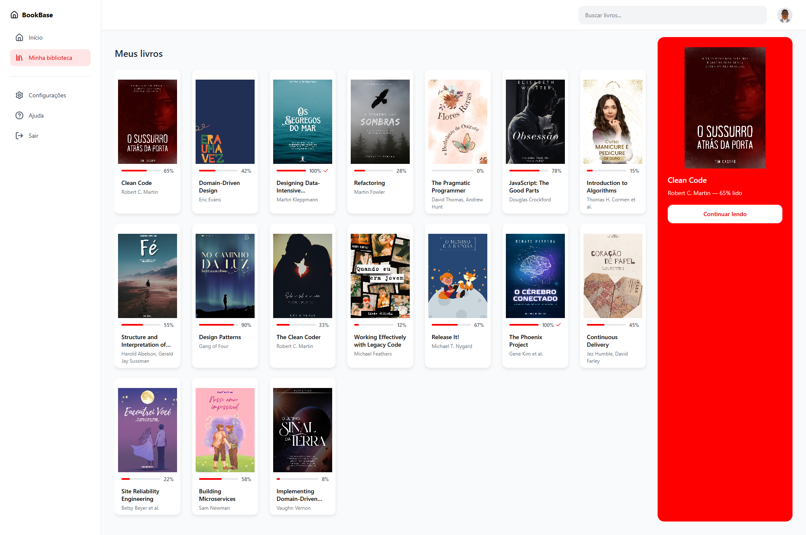

# ebook-sbe – Reading Dashboard

SaaS de dashboard de leitura (livros, categorias, progresso). Interface limpa e minimalista, com design system definido, TypeScript em modo strict, testes com Jest e documentação em Storybook.



## Stack

- **Next.js 15** (App Router)
- **React 19**
- **TypeScript 5**
- **styled-components** (com compiler do Next.js)
- **Jest** + **React Testing Library** + **jest-styled-components**
- **Storybook 8** com `@storybook/nextjs`
- **ESLint** (flat config) + **Prettier**
- **EditorConfig**
- **Husky** + **lint-staged** (pre-commit)

## Comandos

| Comando | Descrição |
|---------|-----------|
| `npm run dev` | Servidor de desenvolvimento em `localhost:3000` |
| `npm run build` | Build de produção |
| `npm run start` | Servidor com build de produção |
| `npm run lint` | Executa o ESLint |
| `npm run lint:fix` | ESLint com correção automática |
| `npm run test` | Testes com Jest |
| `npm run test:watch` | Testes em modo watch |
| `npm run test:ci` | Testes em modo CI (runInBand) |
| `npm run storybook` | Storybook em `localhost:6006` |
| `npm run build-storybook` | Build estático do Storybook |

## Estrutura

```
src/
├── app/                        # App Router
│   ├── book/[id]/              # Página de leitura do livro
│   ├── lib/                    # Utilitários (styled-registry)
│   ├── minha-biblioteca/       # Página e view da biblioteca
│   ├── LoggedInView/           # Layout da área logada
│   ├── globals.css
│   ├── layout.tsx
│   ├── not-found.tsx
│   ├── page.tsx
│   └── LoginPage.tsx
├── components/                 # Componentes reutilizáveis
│   ├── Aside/
│   ├── Auth/
│   ├── BookCard/
│   ├── Button/
│   ├── Header/
│   ├── HydrationFix.tsx
│   ├── Input/
│   ├── Login/
│   ├── Profile/
│   ├── RecoverPassword/
│   ├── ResetPassword/
│   ├── Search/
│   ├── Sidebar/
│   ├── SignUp/
│   ├── Skeleton/               # Skeletons (Aside, BookCard, Header, Sidebar)
│   └── UpdatePassword/
├── contexts/                   # React Context (Icon, User)
├── mocks/                      # Dados mock (loggedUser)
├── styles/                     # GlobalStyles, theme
└── types/                      # Tipos (user)
```

Cada componente segue o padrão: pasta com `ComponentName.tsx`, `styles.ts` (styled-components com `import * as S from './styles'`), `index.ts` (barrel), `test.tsx` e `stories.tsx`. Os estilos usam tokens de `@/styles/theme`.

## Desenvolvimento

1. Instale as dependências: `npm install`
2. Rode o projeto: `npm run dev`
3. Abra [http://localhost:3000](http://localhost:3000)

No pre-commit (Husky + lint-staged): ESLint --fix e Jest nos arquivos alterados em `src/**/*.{ts,tsx}`.

Para inspecionar os componentes: `npm run storybook` e abra [http://localhost:6006](http://localhost:6006).

## Referências

- [Next.js Documentation](https://nextjs.org/docs)
- [styled-components](https://styled-components.com/)
- [Storybook for Next.js](https://storybook.js.org/docs/get-started/frameworks/nextjs)
- [Jest with Next.js](https://nextjs.org/docs/app/building-your-application/testing/jest)
